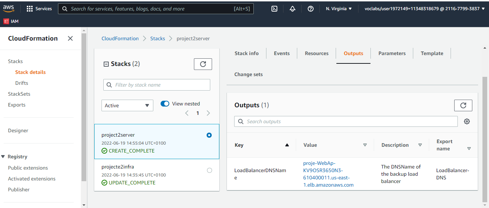

# Udacity Project 2
 - Name: Ayantunde Tolu
 - Date: June 18th, 2022 - 22:00 

## Architecture Diagram


## Cloudformation_Output_LoadBalancer-DNS


## Web page screenshoot


## Create Infrastructure 
```
aws cloudformation create-stack --stack-name projectchallengeinfra2 --template-body file://.\infrastructure.yml --parameters file://.\infrastructure-param.json --capabilities "CAPABILITY_IAM" "CAPABILITY_NAMED_IAM" --region=us-east-1

```

## Update Infrastructure 
```
aws cloudformation update-stack --stack-name projectchallengeinfra2 --template-body file://.\infrastructure.yml --parameters file://.\infrastructure-param.json --capabilities "CAPABILITY_IAM" "CAPABILITY_NAMED_IAM" --region=us-east-1

```
## Delete Infrastructure 
```
aws cloudformation delete-stack --stack-name projectchallengeinfra2 

```

## Create server 
```
aws cloudformation create-stack --stack-name projet2server --template-body file://.\server.yml --parameters file://.\server-param.json --capabilities "CAPABILITY_IAM" "CAPABILITY_NAMED_IAM" --region=us-east-1

```

## Update server 
```
aws cloudformation update-stack --stack-name projet2server --template-body file://.\server.yml --parameters file://.\server-param.json --capabilities "CAPABILITY_IAM" "CAPABILITY_NAMED_IAM" --region=us-east-1

```

## Delete server 
```
aws cloudformation delete-stack --stack-name projet2server

```